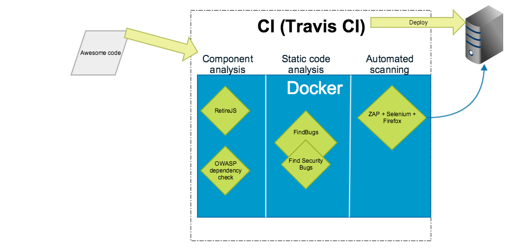

# Docker DevSec demo project

[](https://travis-ci.org/lokori/docker-devsec-demo)

Demo project about automating security testing with Docker. In this case we are running the stuff with [Travis CI](https://travis-ci.org/).

Intentionally the source codes in this repository have some findings reported by the tools. Especially the Python application **is intentionally vulnerable to attacks** so do understand that running it on your own servers (as a demonstration) is a security risk!


Currently this repository demonstrates using these tools through Docker containers:

1. [OWASP Dependency Check](https://www.owasp.org/index.php/OWASP_Dependency_Check)
2. [OWASP ZAP](owasp.org/index.php/OWASP_Zed_Attack_Proxy_Project)
3. [retire.js](https://retirejs.github.io/retire.js/)
4. [Find Security Bugs](http://find-sec-bugs.github.io/) (+ [FindBugs](http://findbugs.sourceforge.net/))




## Note about ZAP scanning

In the usual case scanning requires authenticating the test user with some credentials. This is not currently easy, but soon will be. See [issue at GitHub](https://github.com/Grunny/zap-cli/issues/7).

Another common trick is to use some sort of custom HTTP header (mocking SSO frontend for example) which specifies the authenticated user. This can be achieved like this. Load a custom script which forces a HTTP header for each request.

```
zap-cli scripts load --name=force-auth --script-type=proxy --engine='Oracle Nashorn' --file-path=$(pwd)zap-header.js
```

Essentially zap-header.js boils down to this in this example:
```
function proxyRequest(msg) {
    msg.getRequestHeader().setHeader("user-auth", "test-user")
    return true
}
```


## Example log from Travis CI

For real projects, you would probably want to tune the tools to generate HTML reports or something more readable and host these documents somewhere instead of having a load of stuff within the build server log. See [sample Travis CI log](travis-log.txt) as an example. 

## Reports out of the docker container

This is currently under development, but this example now uploads some of the generated reports to Amazon S3 bucket from Travis. This means basically mounting a local directory for the Docker container so that the container can write a file to the host machine. After container shuts down the file is then uploaded to S3.


http://devsec.s3-website-eu-west-1.amazonaws.com/findsec-report.html


